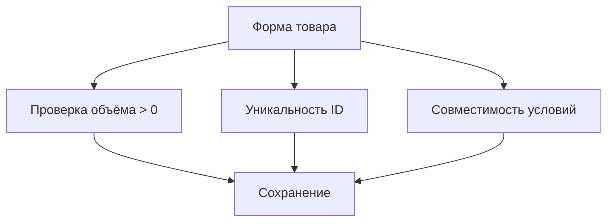

# План реализации интерфейса

## Архитектура компонентов

```
src/features/params/
├── ProductForm.tsx      # Форма ввода товаров
├── CellForm.tsx         # Форма ввода ячеек
└── FormsContainer.tsx   # Управление состоянием форм
```

## Изменения в хранилище данных

1. Обновление типов данных:

```typescript
interface Product {
  id: number;
  volume: number;
  storageCondition: 'холод' | 'сухо' | 'обычные';
  incompatibleWith: number[];
}

interface Cell {
  id: string;
  capacity: number;
  zoneCondition: 'холод' | 'сухо' | 'обычные';
}
```

2. Реализация методов:

- `addProduct(product: Product)`
- `removeProduct(id: number)`
- `addCell(cell: Cell)`
- `removeCell(id: string)`

## Валидация данных



## Этапы разработки

1. Создание компонентов форм - 2 дня
2. Интеграция с хранилищем - 1 день
3. Реализация валидации - 1 день
4. Тестирование - 1 день
