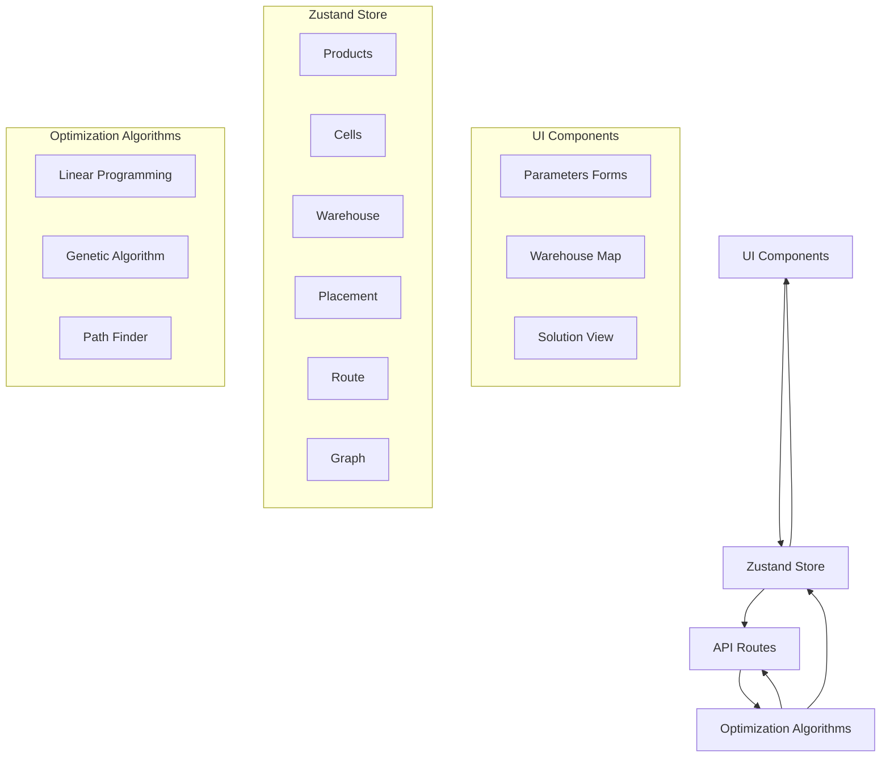
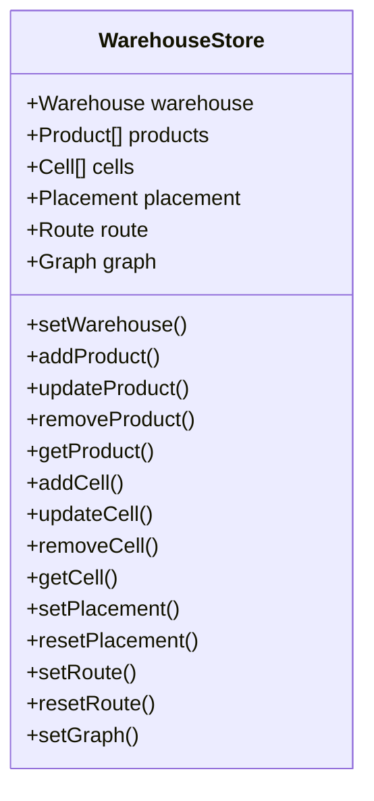
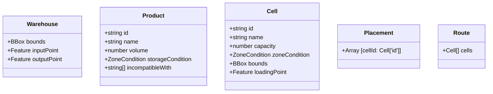
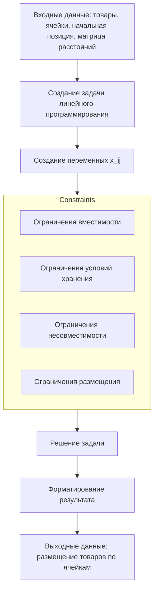
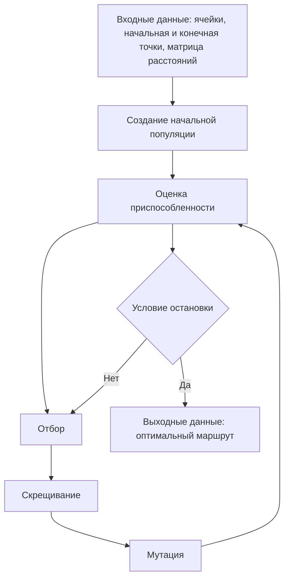
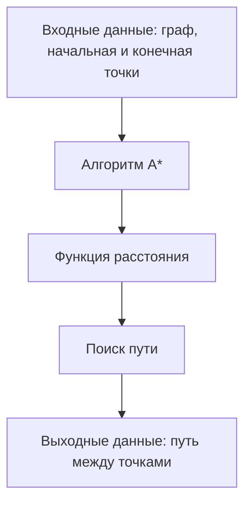
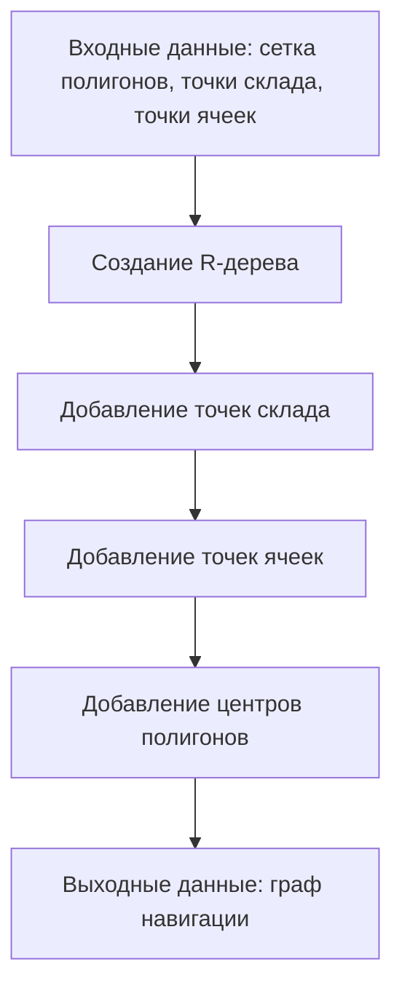
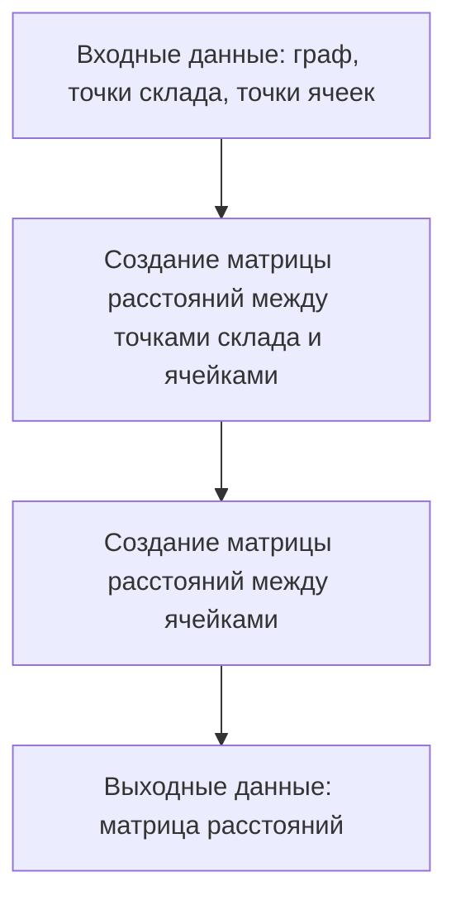
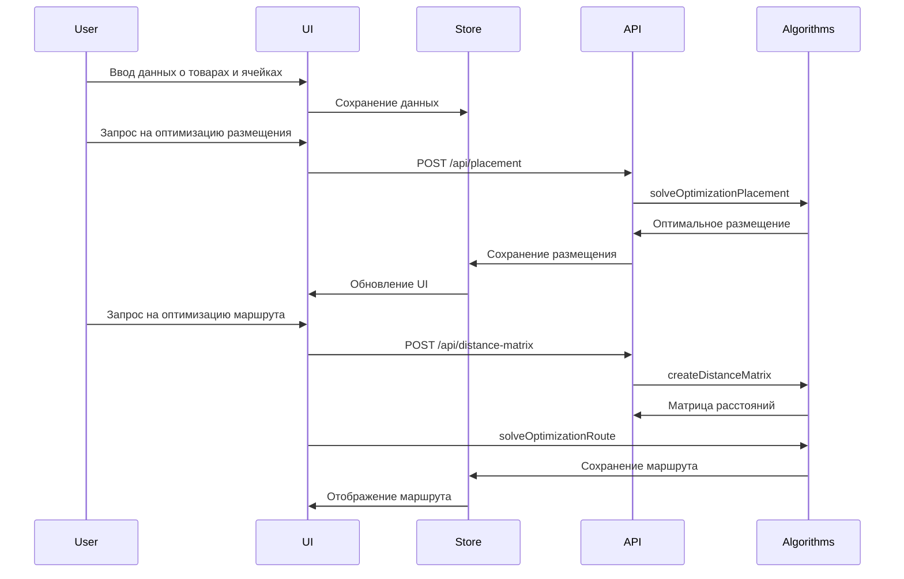

# Обзор архитектуры Warehouse Helper

## Введение

Warehouse Helper - это веб-приложение для оптимизации организации склада, которое решает три основные задачи:

1. Определение расположения и конфигурации стеллажей для хранения
2. Оптимальное распределение товаров на полках при поступлении и отгрузке
3. Построение оптимального маршрута по складу

Данный документ описывает архитектуру приложения, его основные компоненты и их взаимодействие.

## Общая архитектура

Приложение построено на основе фреймворка Next.js с использованием TypeScript. Архитектура приложения может быть представлена следующей диаграммой:

## Основные компоненты

### 1. Хранилище данных (Zustand Store)

Центральное хранилище данных реализовано с использованием библиотеки Zustand. Оно хранит все данные приложения и предоставляет методы для их изменения.

### 2. Модели данных

Основные типы данных, используемые в приложении:

### 3. Алгоритмы оптимизации

#### 3.1. Оптимизация размещения товаров (Linear Programming)

Для оптимального размещения товаров в ячейках используется линейное программирование (библиотека glpk.js).

#### 3.2. Оптимизация маршрута (Genetic Algorithm)

Для построения оптимального маршрута обхода ячеек используется генетический алгоритм (библиотека genetic-js).

#### 3.3. Поиск пути (Path Finder)

Для нахождения пути между точками используется алгоритм A\* (библиотека ngraph.path).

### 4. Граф навигации

Для навигации по складу создается граф, где узлы - это точки (точки склада, точки ячеек и центры полигонов сетки), а ребра - это линии, соединяющие точки.

### 5. Матрица расстояний

Для быстрого доступа к расстояниям между точками создается матрица расстояний.

## Поток данных

Общий поток данных в приложении можно представить следующей диаграммой:

## Заключение

Архитектура приложения Warehouse Helper хорошо структурирована и разделена на логические компоненты. Использование современных библиотек и фреймворков (Next.js, Zustand, GLPK.js, genetic-js) позволяет эффективно решать задачи оптимизации склада.

Основные преимущества архитектуры:

1. Четкое разделение ответственности между компонентами
2. Централизованное хранилище данных
3. Модульная структура, позволяющая легко расширять функциональность
4. Использование специализированных алгоритмов для решения конкретных задач оптимизации

Возможные улучшения:

1. Добавление серверной части для выполнения тяжелых вычислений
2. Реализация кэширования результатов оптимизации
3. Добавление возможности сохранения и загрузки конфигураций склада
4. Улучшение алгоритмов оптимизации для работы с большими объемами данных
