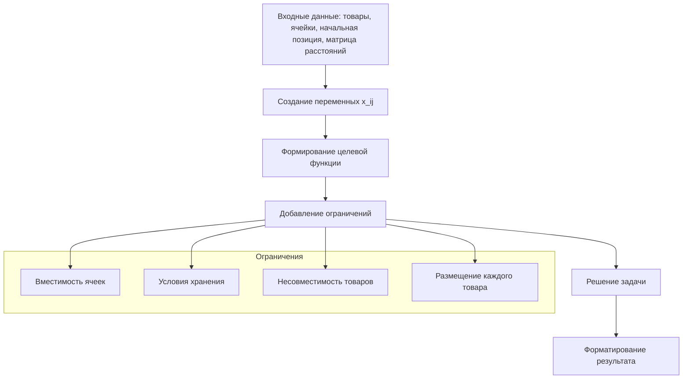
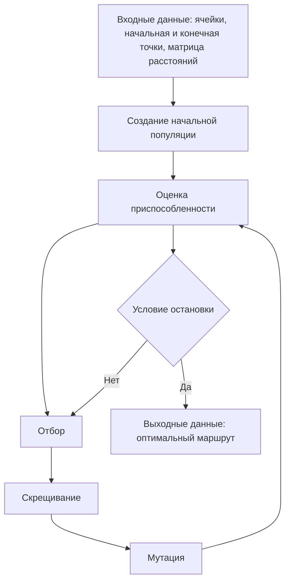
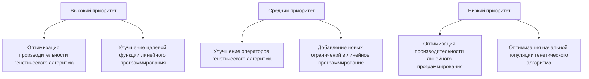

# Анализ и улучшение алгоритмов оптимизации в Warehouse Helper

## 1. Обзор текущих алгоритмов

### 1.1. Линейное программирование для оптимизации размещения товаров

Текущая реализация использует библиотеку GLPK.js для решения задачи линейного программирования с целочисленными переменными. Основные компоненты:



#### Сильные стороны:

- Гарантирует нахождение оптимального решения
- Корректно учитывает все ограничения
- Эффективно работает с небольшим и средним количеством товаров и ячеек

#### Ограничения:

- Производительность может снижаться при большом количестве товаров и ячеек
- Не учитывает динамические изменения в складе
- Целевая функция учитывает только расстояние от начальной точки до ячеек

### 1.2. Генетический алгоритм для оптимизации маршрута

Текущая реализация использует библиотеку genetic-js для решения задачи оптимизации маршрута (вариант задачи коммивояжера). Основные компоненты:



#### Сильные стороны:

- Хорошо работает с задачей коммивояжера
- Может находить близкие к оптимальным решения за разумное время
- Гибкая настройка параметров алгоритма

#### Ограничения:

- Не гарантирует нахождение глобального оптимума
- Производительность снижается экспоненциально с ростом числа ячеек
- Текущая реализация генерирует все возможные перестановки, что неэффективно для большого числа ячеек

## 2. Предлагаемые улучшения

### 2.1. Улучшения линейного программирования

#### 2.1.1. Оптимизация целевой функции

- Учет не только расстояния от начальной точки до ячеек, но и расстояния между ячейками
- Добавление весовых коэффициентов для различных факторов (расстояние, частота доступа к товарам)

```typescript
// Пример улучшенной целевой функции
products.forEach(product => {
  cells.forEach(cell => {
    const varName = `x_${product.id}_${cell.id}`;
    lp.objective.vars.push({
      name: varName,
      coef:
        distanceMatrix[`${startPosition.id}-${cell.loadingPoint.id}`].distance *
        (1 + product.accessFrequency / 10), // Учет частоты доступа
    });
    lp.binaries?.push(varName);
  });
});
```

#### 2.1.2. Добавление новых ограничений

- Учет зонирования склада
- Учет приоритетов товаров
- Учет сезонности и временных ограничений

```typescript
// Пример добавления ограничений зонирования
products.forEach(product => {
  cells.forEach(cell => {
    if (product.zone && product.zone !== cell.zone) {
      const varName = `x_${product.id}_${cell.id}`;
      lp.subjectTo.push({
        name: `zone_${product.id}_${cell.id}`,
        vars: [{name: varName, coef: 1}],
        bnds: {type: glpk.GLP_FX, ub: 0, lb: 0},
      });
    }
  });
});
```

#### 2.1.3. Оптимизация производительности

- Использование разреженных матриц для представления ограничений
- Предварительная фильтрация несовместимых пар товар-ячейка
- Использование более эффективных решателей (например, CBC, CPLEX)

### 2.2. Улучшения генетического алгоритма

#### 2.2.1. Оптимизация начальной популяции

- Использование эвристик для создания более качественной начальной популяции
- Применение жадного алгоритма для создания нескольких хороших начальных решений

```typescript
// Пример улучшенной функции seed
genetic.seed = function () {
  // Случайная перестановка
  if (Math.random() < 0.7) {
    const randomIndex = Math.floor(
      Math.random() * this.userData.permutations.length
    );
    return this.userData.permutations[randomIndex];
  }

  // Жадный алгоритм
  return createGreedySolution(
    this.userData.startPoint,
    this.userData.distanceMatrix
  );
};
```

#### 2.2.2. Улучшение операторов скрещивания и мутации

- Реализация более эффективных операторов скрещивания (OX, PMX, CX)
- Адаптивная вероятность мутации в зависимости от разнообразия популяции

```typescript
// Пример улучшенного оператора скрещивания (PMX - Partially Mapped Crossover)
genetic.crossover = function (parent1, parent2) {
  return [pmxCrossover(parent1, parent2), pmxCrossover(parent2, parent1)];
};

function pmxCrossover(parent1, parent2) {
  // Реализация PMX оператора
  // ...
}
```

#### 2.2.3. Оптимизация производительности

- Отказ от генерации всех возможных перестановок
- Использование более эффективных структур данных
- Параллельное выполнение оценки приспособленности

```typescript
// Пример оптимизации без генерации всех перестановок
export function solveOptimizationRoute(
  cells: Cell[],
  startPoint: Feature<Point>,
  endPoint: Feature<Point>,
  distanceMatrix: DistanceMatrix
): Promise<Solution> {
  // Не генерируем все перестановки
  // const permutations = getPermutations(cells);

  const geneticUserData = {
    distanceMatrix,
    cells, // Передаем сами ячейки вместо перестановок
    getRandomIndex,
    startPoint,
    endPoint,
  };

  // Остальной код...
}
```

## 3. План реализации улучшений

### 3.1. Приоритеты улучшений



### 3.2. Этапы реализации

#### Этап 1: Оптимизация производительности генетического алгоритма

- Отказ от генерации всех возможных перестановок
- Оптимизация структур данных
- Оценка производительности и сравнение с текущей реализацией

#### Этап 2: Улучшение целевой функции линейного программирования

- Добавление учета частоты доступа к товарам
- Учет расстояния между ячейками
- Тестирование и оценка качества размещения

#### Этап 3: Улучшение операторов генетического алгоритма

- Реализация PMX оператора скрещивания
- Реализация адаптивной мутации
- Тестирование и оценка качества маршрутов

#### Этап 4: Добавление новых ограничений в линейное программирование

- Добавление зонирования склада
- Добавление приоритетов товаров
- Тестирование и оценка влияния новых ограничений

## 4. Оценка эффективности улучшений

### 4.1. Метрики для оценки

#### Линейное программирование:

- Время выполнения алгоритма
- Качество размещения (суммарное расстояние)
- Использование вместимости ячеек (%)
- Соблюдение всех ограничений (%)

#### Генетический алгоритм:

- Время выполнения алгоритма
- Качество маршрута (общая длина)
- Скорость сходимости (поколения до стабилизации)
- Разнообразие популяции

### 4.2. Методология тестирования

1. Создание набора тестовых данных различного размера
2. Запуск текущих и улучшенных алгоритмов на тестовых данных
3. Сравнение результатов по выбранным метрикам
4. Визуализация результатов для анализа

## 5. Заключение

Предложенные улучшения алгоритмов оптимизации позволят повысить эффективность работы приложения Warehouse Helper, особенно при работе с большими складами и большим количеством товаров. Основной фокус улучшений направлен на:

1. Повышение производительности алгоритмов
2. Улучшение качества получаемых решений
3. Добавление новых возможностей и ограничений

Реализация этих улучшений должна выполняться поэтапно, с тщательным тестированием каждого изменения для обеспечения стабильности и эффективности работы приложения.
